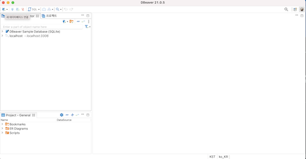
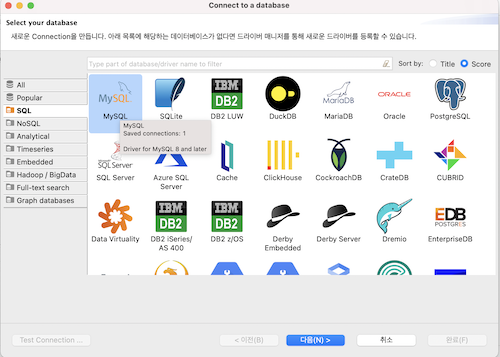
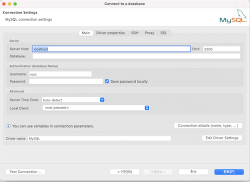
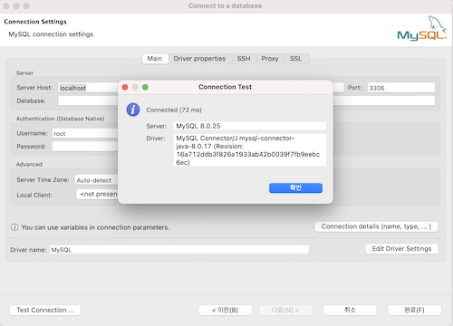
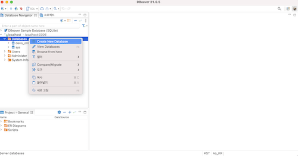
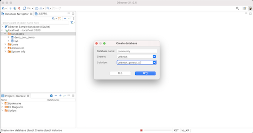
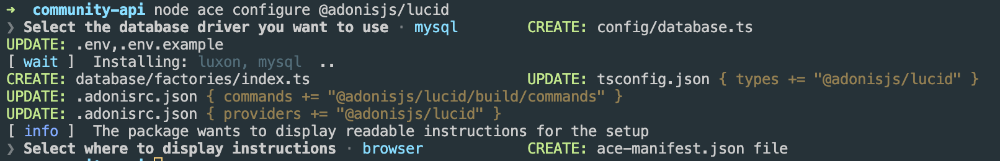

# AdonisJs

- Node.js를 기반으로 한 백엔드 프레임워크
- AdonisJS 프레임워크는 TypeScript로 작성

## 설치방법

- Node.js LTS 설치
- Mysql 또는 mariadb 또는 postgresql (데이터베이스는 어떤거를 사용해도 크게 상관은 없음) 일단은 mysql 기준으로 사용
- npm init adonis-ts-app@latest [폴더명]
  1. Select the project structure -> api
  2. Enter the project name -> [폴더명]
  3. Setup eslint? -> N (false)
  - 위 부분(1~3번)은 프로젝트에 따라 달라질수 있음
- 서버 구동 시키는 방법

  ```
      // Run following commands to get started

      cd [폴더명]
      node ace serve --watch
  ```

- 또는 서버 구동 시키는은 방법 비주얼 스튜디오 터미널에서
  npm run dev
- Node ace
  - 터미널에 node ace 를 쳐보면 node ace 에 쓸수있는 모든 명령어 목록들이 나온다 (필요한 명령어들이 있다면 node ace로 확인 해서 써보자)

https://docs.adonisjs.com/guides/installation 에 있는 Fundamentals 은 한번씩 읽어보면 좋다

<br>

## Http

### ontext

```
    Route.get('/', ({ request, auth, response }) => {

    }
```

- request(요청)는 받은 요청(input)
- response(응답)는 내가 클라이언트쪽으로 내보내는 것(output)
- auth(인증)는 input 과 output 사이에 일어나는 내용들
- 그렇기 때문에 context는 request로 시작해서 response로 끝나는 전반적인 맥락들이 여기 안에 들어가져있다.

### Routing

- 여러개 api들이 만들어지고 거기에 주소를 할당에 대한 방법이 나와있다.
- routing은 start/routes.ts 에 선언이 된다.
- 형태는 두가지 이다.

1. 앞에 이름이 전달이 되고 뒤에는 함수가 선언이 되는 방법

```
    import Route from '@ioc:Adonis/Core/Route'

    Route.get('/', () => {
        return 'Hello world'
    })
```

2. 컨트롤러와 함수명이 전달이 되는 방법

```
    import Route from '@ioc:Adonis/Core/Route'

    Route.get('posts', 'PostsController.index')
```

### Controllers

- 라우터에서 할당된 내용들을 용도별로 나눠서 하는곳

- controllers를 만들때에는 터미널에 node ace make:controller [파일명]

```
    예시)
    node ace make:controller AppController
    node ace make:controller AuthController
    node ace make:controller UserController
```

터미널에 위 코드를 치게 되면은
app/Controllers/Http/AppController.ts
app/Controllers/Http/AuthController.ts
app/Controllers/Http/UserController.ts 가 생기게 된다.

<br>

## Http method

HTTP는 요청 메서드를 정의

- GET

  - 특정 리소스의 표시를 요청
  - GET을 사용하는 요청은 오직 데이터를 받기만 한다
  - 주소를 통해서 요청하는 것은 GET 방식
  - 가장 많이 접하는 방식

- POST

  - 특정 리소스에 엔티티를 제출할 때 쓰인다.

- PATCH

  - 리소스의 부분만을 수정하는 데 쓰인다.

- PUT

  - 적 리소스 모든 현재 표시를 요청 payload로 바꾼다.

- DELETE
  - 특정 리소스를 삭제한다.

### [포스트맨](https://www.postman.com/downloads/)

api를 테스트하기 위한 간단한 도구

- 포스트맨을 이용해서 HTTP 요청 메소드들을 확인 해보자

<br>

## restful api

- HTTP 통신에서 어떤 자원에 대한 CRUD 요청을 Resource와 Method로 표현하여 특정한 형태로 전달하는 방식

### REST 란?

- 어떤 자원에 대해 CRUD(Create, Read, Update, Delete) 연산을 수행하기 위해 URI(Resource)로 요청을 보내는 것으로, Get, Post 등의 방식(Method)을 사용하여 요청을 보내며, 요청을 위한 자원은 특정한 형태(Representation of Resource)으로 표현

### RESTful API의 구성요소

- Resource

  - 서버는 Unique한 ID를 가지는 Resource를 가지고 있으며, 클라이언트는 이러한 Resource에 요청을 보냅니다. 이러한 Resource는 URI에 해당 한다.

- Method

  - 서버에 요청을 보내기 위한 방식으로 GET, POST, PUT, PATCH, DELETE가 있다. CRUD 연산 중에서 처리를 위한 연산에 맞는 Method를 사용하여 서버에 요청을 보내야 한다.

- Representation of Resource
  - 클라이언트와 서버가 데이터를 주고받는 형태로 json, xml, text, rss 등이 있다. 최근에는 Key, Value를 활용하는 json을 주로 사용한다.

### RESTful API 예시

```
    // routes.ts

    Route.get('/articles', () => {} );  //목록
    Route.post('/articles', () => {} );  //신규 생성
    Route.get('/articles/:id', () => {} );  //개별 조회
    Route.patch('/articles/:id', () => {} );  //수정
    Route.delete('/articles/:id', () => {} );  //삭제
```

<br>

그러나 실제 리소스가 아니고 어떤 동작에 대한 것들도 필연적으로 만들수밖에 없다.
RESTful API를 준수해서 만들어야 된다는 강제사항이 있지 않다면 밑에 예시처럼 섞어서 사용할 수 있다.

```
    // routes.ts

    Route.post('/sign-in', () => {} );
    Route.post('/sign-out', () => {} );
```

위의 예시는 HTTP API 라고 하거나 혹은 restful 형식을 빌린 HTTP API 라고 부를수 있다. 근데 이런것들을 통칭으로 restful api 라고 하는 경우도 많이 있다.

## dbeaver-community

- SQL 클라이언트이자 데이터베이스 관리 도구
- [dbeaver-community 설치](https://formulae.brew.sh/cask/dbeaver-community#default)
- dbeaver 설치가 끝났다면 실행 하기

1. 새 데이터 베이스 연결 클릭

   

2. 자기 버전에 맞는 mysql 선택

   

3. connect to a databse

   

4. Test Connection 클릭

   

   - 입력한 정보가 맞는지 확인

5. 데이터베이스 추가 하기

   

6. charset, collation

   

   - Charset: utf8mb4
   - Collation: utf8mb4_general_ci

   [※ 참고하기 좋은 블로그](https://devvkkid.tistory.com/205)

<br>

## Database

1. [Database 라이브러리 터미널로 설치](https://docs.adonisjs.com/guides/database/introduction)

```
    npm i @adonisjs/lucid
```

2. 어떤 데이터 베이스를 쓸건지 터미널로 체크

```
    node ace configure @adonisjs/lucid
```

- space 를 한다음에 select를 해야 한다(복수선택을 위함)
- MySQL/MariaDB 선택
- brower 에서 볼건지 terminal로 볼건지 선택
  - 나중에는 terminal 이 편하지만 지금은 brower로 확인 해보기

<br>

1~2번 까지 다 했다면 밑에 처럼 파일이 추가 되고 업데이트 된 걸 확인할 수 있다.

