# AdonisJs

- Node.js를 기반으로 한 백엔드 프레임워크
- AdonisJS 프레임워크는 TypeScript로 작성

## 설치방법

- Node.js LTS 설치
- Mysql 또는 mariadb 또는 postgresql (데이터베이스는 어떤거를 사용해도 크게 상관은 없음) 일단은 mysql 기준으로 사용
- npm init adonis-ts-app@latest [폴더명]
  1. Select the project structure -> api
  2. Enter the project name -> [폴더명]
  3. Setup eslint? -> N (false)
  - 위 부분(1~3번)은 프로젝트에 따라 달라질수 있음
- 서버 구동 시키는 방법

  ```
      // Run following commands to get started

      cd [폴더명]
      node ace serve --watch
  ```

- 또는 서버 구동 시키는은 방법 비주얼 스튜디오 터미널에서
  npm run dev
- Node ace
  - 터미널에 node ace 를 쳐보면 node ace 에 쓸수있는 모든 명령어 목록들이 나온다 (필요한 명령어들이 있다면 node ace로 확인 해서 써보자)

https://docs.adonisjs.com/guides/installation 에 있는 Fundamentals 은 한번씩 읽어보면 좋다

<br>

## Http

### ontext

```
    Route.get('/', ({ request, auth, response }) => {

    }
```

- request(요청)는 받은 요청(input)
- response(응답)는 내가 클라이언트쪽으로 내보내는 것(output)
- auth(인증)는 input 과 output 사이에 일어나는 내용들
- 그렇기 때문에 context는 request로 시작해서 response로 끝나는 전반적인 맥락들이 여기 안에 들어가져있다.

### Routing

- 여러개 api들이 만들어지고 거기에 주소를 할당에 대한 방법이 나와있다.
- routing은 start/routes.ts 에 선언이 된다.
- 형태는 두가지 이다.

1. 앞에 이름이 전달이 되고 뒤에는 함수가 선언이 되는 방법

```
    import Route from '@ioc:Adonis/Core/Route'

    Route.get('/', () => {
        return 'Hello world'
    })
```

2. 컨트롤러와 함수명이 전달이 되는 방법

```
    import Route from '@ioc:Adonis/Core/Route'

    Route.get('posts', 'PostsController.index')
```

### Controllers

- 라우터에서 할당된 내용들을 용도별로 나눠서 하는곳

- controllers를 만들때에는 터미널에 node ace make:controller [파일명]

```
    예시)
    node ace make:controller AppController
    node ace make:controller AuthController
    node ace make:controller UserController
```

터미널에 위 코드를 치게 되면은
app/Controllers/Http/AppController.ts
app/Controllers/Http/AuthController.ts
app/Controllers/Http/UserController.ts 가 생기게 된다.

<br>

## Http method

HTTP는 요청 메서드를 정의

- GET

  - 특정 리소스의 표시를 요청
  - GET을 사용하는 요청은 오직 데이터를 받기만 한다
  - 주소를 통해서 요청하는 것은 GET 방식
  - 가장 많이 접하는 방식

- POST

  - 특정 리소스에 엔티티를 제출할 때 쓰인다.

- PATCH

  - 리소스의 부분만을 수정하는 데 쓰인다.

- PUT

  - 적 리소스 모든 현재 표시를 요청 payload로 바꾼다.

- DELETE
  - 특정 리소스를 삭제한다.

### [포스트맨](https://www.postman.com/downloads/)

api를 테스트하기 위한 간단한 도구

- 포스트맨을 이용해서 HTTP 요청 메소드들을 확인 해보자

<br>

## restful api

- HTTP 통신에서 어떤 자원에 대한 CRUD 요청을 Resource와 Method로 표현하여 특정한 형태로 전달하는 방식

### REST 란?

- 어떤 자원에 대해 CRUD(Create, Read, Update, Delete) 연산을 수행하기 위해 URI(Resource)로 요청을 보내는 것으로, Get, Post 등의 방식(Method)을 사용하여 요청을 보내며, 요청을 위한 자원은 특정한 형태(Representation of Resource)으로 표현

### RESTful API의 구성요소

- Resource

  - 서버는 Unique한 ID를 가지는 Resource를 가지고 있으며, 클라이언트는 이러한 Resource에 요청을 보냅니다. 이러한 Resource는 URI에 해당 한다.

- Method

  - 서버에 요청을 보내기 위한 방식으로 GET, POST, PUT, PATCH, DELETE가 있다. CRUD 연산 중에서 처리를 위한 연산에 맞는 Method를 사용하여 서버에 요청을 보내야 한다.

- Representation of Resource
  - 클라이언트와 서버가 데이터를 주고받는 형태로 json, xml, text, rss 등이 있다. 최근에는 Key, Value를 활용하는 json을 주로 사용한다.

### RESTful API 예시

```
    // routes.ts

    Route.get('/articles', () => {} );  //목록
    Route.post('/articles', () => {} );  //신규 생성
    Route.get('/articles/:id', () => {} );  //개별 조회
    Route.patch('/articles/:id', () => {} );  //수정
    Route.delete('/articles/:id', () => {} );  //삭제
```

<br>

그러나 실제 리소스가 아니고 어떤 동작에 대한 것들도 필연적으로 만들수밖에 없다.
RESTful API를 준수해서 만들어야 된다는 강제사항이 있지 않다면 밑에 예시처럼 섞어서 사용할 수 있다.

```
    // routes.ts

    Route.post('/sign-in', () => {} );
    Route.post('/sign-out', () => {} );
```

위의 예시는 HTTP API 라고 하거나 혹은 restful 형식을 빌린 HTTP API 라고 부를수 있다. 근데 이런것들을 통칭으로 restful api 라고 하는 경우도 많이 있다.

## dbeaver-community

- SQL 클라이언트이자 데이터베이스 관리 도구
- [dbeaver-community 설치](https://formulae.brew.sh/cask/dbeaver-community#default)
- dbeaver 설치가 끝났다면 실행 하기

1. 새 데이터 베이스 연결 클릭

   

2. 자기 버전에 맞는 mysql 선택

   

3. connect to a databse

   

4. Test Connection 클릭

   

   - 입력한 정보가 맞는지 확인

5. 데이터베이스 추가 하기

   

6. charset, collation

   

   - Charset: utf8mb4
   - Collation: utf8mb4_general_ci

   [※ 참고하기 좋은 블로그](https://devvkkid.tistory.com/205)

<br>

## Database

1. [Database 라이브러리 터미널로 설치](https://docs.adonisjs.com/guides/database/introduction)

```
    npm i @adonisjs/lucid
```

2. 어떤 데이터 베이스를 쓸건지 터미널로 체크

```
    node ace configure @adonisjs/lucid
```

- space 를 한다음에 select를 해야 한다(복수선택을 위함)
- MySQL/MariaDB 선택
- brower 에서 볼건지 terminal로 볼건지 선택
  - 나중에는 terminal 이 편하지만 지금은 brower로 확인 해보기

<br>

1~2번 까지 다 했다면 밑에 터미널 처럼 어떤 파일이 추가 되고 업데이트 되었는지 확인할 수 있다.


<br>

### Schema migrations

- 여태 데이터를 가져 오거나 유지하는 방법에 대해 배웠다면 지금 부터는 데이터베이스 테이블 생성 / 변경 을 위한 스키마 마이그레이션을 배우자

### migrations 만들기

1. ace 명령을 실행하여 새 마이그레이션 파일을 생성

```
    node ace make:migration [파일명]
```

2. ace 명령을 실행하여 새로 만든 마이그레이션 파일을 실행

```
    node ace migration:run
```

- Error: ER_NOT_SUPPORTED_AUTH_MODE: Client does not support authentication protocol requested by server; consider upgrading MySQL client / 에러가 뜰 경우

  - 해결 방법(해결 방법은 두가지)

  1. mySQL에 접속해서 아래 명령어를 입력

  ```
      ALTER USER '[계정]'@'[호스트]' IDENTIFIED WITH mysql_native_password BY '[비밀번호]';
  ```

  2. mysql installer > server 옆에 reconfigure > Auth 설정가서 legacy 선택 > 완료(이거는 해보지 않아서 되는지 모르겠음)
     <br>

- 내가 해결한 방법

  - DBeaver 에서 SQL 클릭 후 script를 추가해서 비밀번호 설정

  ```
      // 예시
      ALTER USER 'root'@'localhost' IDENTIFIED WITH mysql_native_password BY '12341234';

      ALTER USER '[계정]'@'[호스트]' IDENTIFIED WITH mysql_native_password BY '[비밀번호]';
  ```

  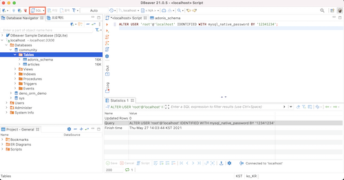

  - local 다시 실행

  ```
      npm run dev
  ```

  - local 다시 실행 후 node ace migration:run 명령어를 치면 DBeaver에 새로운 articles[파일명] 이라는 마이그레이션 파일이 생성된것을 확인 할 수 있다.

3. 마이그레이션 파일 수정 해보기

   - 1622089873166_articles.ts 에 밑에 텍스트를 추가 해보자

   ```
       table.string("subject");
       table.string("author");
       table.text("content");
   ```

   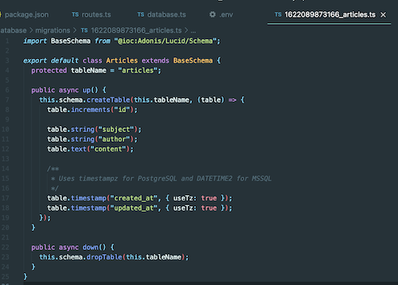

   - 마이그레이션은 파일 내용의 업데이트를 따르지 않고 파일 개수로 업데이트를 한다. 그렇기 때문에 파일 내용 수정을 하고 node ace migration:run 실행을 하면 "Alerady up to date" 라고 전부다 최신상태 라고 하며 실행이 안될거다.
   - 실행이 안될 때는 node ace migration:rollback 라는 명령어를 입력한다.

   ```
       node ace migration:rollback
   ```

   rollback을 하게 되면은 어떤 파일이 rollback이 되었는가에 대한 내용이 나온다. 그 후 다시 node ace migration:run 을 실행 하면 제대로 실행 되는걸 볼 수 있다.

   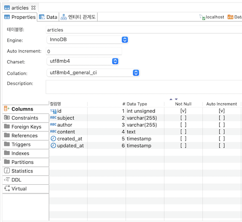

<br>

## ORM

- Object Relational Mapping 즉, 객체-관계 매핑의 줄임말
- ORM을 이용하면 따로 SQL문을 짤 필요없이 객체를 통해 간접적으로 데이터베이스를 조작할 수 있게 된다.

1. 명령어 실행

   ```
       node ace make:model [파일명]

       node act make:model Article
   ```

   - 모델 같은 경우는 테이블이 이름이 복수형으로 권장되는 것처럼 모델은 단수형으로 지정하는 것이 권장된다
   - 명령문을 치면은 app/Models/Article.ts 가 생성된걸 확인할 수 있다.

2. Article.ts 열어서 1622089873166_articles.ts 에 있는 텍스트 추가 하기

   ```
       public subject: string;
       public author: string;
       public content: string;
   ```

   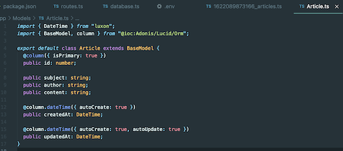

   - subject, author, content 는 자바스크립트 관점에서는 string 이므로 string으로 타입 지정 하기

3. @column() 이라는 [데코레이터](https://ui.toast.com/weekly-pick/ko_20200102) 할당 해주기

   ```
       @column()
       public subject: string;

       @column()
       public author: string;

       @column()
       public content: string;
   ```

4. controller 만들기

   ```
       node ace make:controller [파일명]

       node ace make:controller ArticleController
   ```

   - app/Controllers/Http/ArticlesController.ts 에 생성된걸 확인할 수 있다.

5. ArticlesController.ts 에 함수 만들기

   ```
       public async list() {

       }

       public async create() {

       }

       public async read() {

       }
   ```

   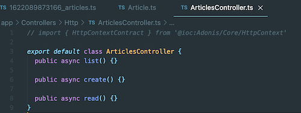

6. routes.ts 에 ArticlesController.list 할당 하기

   ```
       Route.get("/articles", "ArticlesController.list"); //목록
   ```

   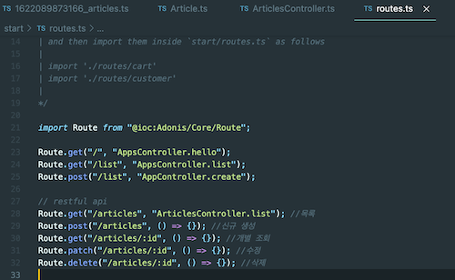

   - 할당 후 npm run dev 다시 실행

7. ArticlesController.ts 에 import 하기

   ```
       import Article from 'App/Models/Article';
   ```

8. 목록 호출

   ```
       public async list() {
           const articles = await Article.all();
           return articles;
       }
   ```

   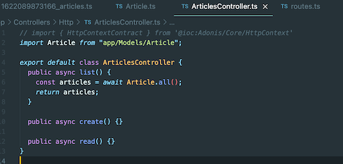

9. 생성하는 함수 수정

   ```
       public async create() {
           const article = new Article();
           article.subject = "ORM을 이용해 입력한 제목";
           article.content = "ORM을 이용해 입력한 본문";
           article.author = "작성장 이름";
           await article.save();

           return article;
       }
   ```

   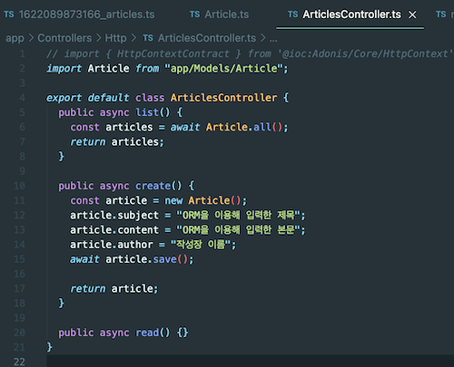

   포스트맨에서 확인 해보기

   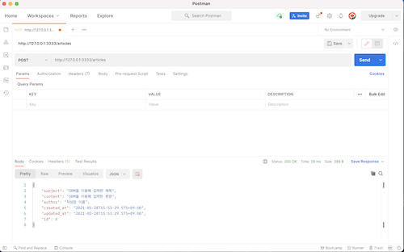

10. ArticlesController에 create 연결하기

    ```
        // routes.ts

        Route.post("/articles", "ArticlesController.create"); //신규 생성
    ```

11. routes.ts 에 ArticlesController.read 할당 하기
    ```
        Route.get("/articles/:id", "ArticlesController.read"); //개별 조회
    ```
12. id로 읽어오기

    ```
        public async read({ params }) {
            const { id } = params;
            const article = await Article.find(id);
            return article;
        }
    ```

    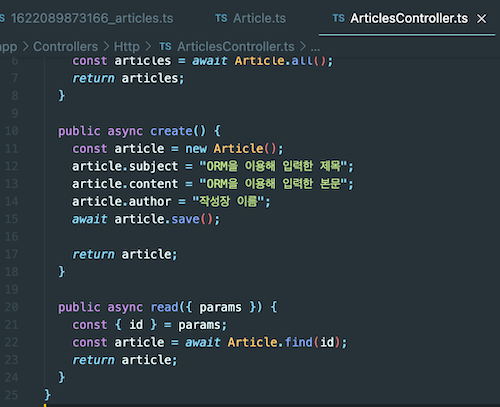

    이렇게 읽어오면 포스트맨에서 밑에처럼 확인해볼 수 있다.

    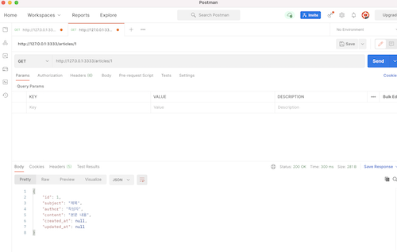

13. 출력

    ```
         public async update({ params }) {
            const { id } = params;
            const article = await Article.findOrFail(id);

            article.subject = "변경된 제목";
            await article.save();

            return article;
        }
    ```

14. 삭제

    ```
          public async delete({ params }) {
                const { id } = params;

                const article = await Article.findOrFail(id);
                await article.delete();

                return "ok";
            }
    ```

### find 함수

- ORM에서 가장 많이 사용하는 함수
- 프라이머 키를 기준으로 하나의 아이템을 조회 하는 함수

### CRUD

- 모델 클래스의 DB 데이터를 추가, 조회, 수정, 삭제를 뜻한다.

### 라우팅(Routing)의 유형

#### 정적 라우팅(Static Routing)

- 정적 라우팅은 라우팅 테이블에 경로를 수동으로 추가해야하는 프로세스
- 예시 : http://127.0.0.1:3333/articles

#### 동적 라우팅(Dynamic Routing)

- 동적 라우팅은 라우팅 테이블에서 경로의 현재 상태에 따라 경로를 자동으로 조정
- 예시 : http://127.0.0.1:3333/articles/1

### Find($id)와 FindOrFail($id) 차이

- find ($ id): ID를 받아서 단일 모델을 반환, 일치하는 모델이 없으면 null을 반환

- findOrFail ($ id): ID를 가져와 단일 모델을 반환, 일치하는 모델이 없으면 error1이 발생

## 실제 사용자가 입력한 데이터 처리

### body안에 넣어서 요청하는는 방법

- request body안에는 다양한 종류의 데이터들을 보낼수가 있다.
- 가장 많이 사용하는 방법
  - form- data
  - x-www-form-urlencoded

```
    public async create({request}){
        // input 에 있는 내용 가져오기
        const subject = request.input(‘subject’);
        const subject = request.input(‘content’);
        const subject = request.input(‘author’);

        // 새로운 함수 만들기
        const article = new Article();

        // 가져온 input 내용을 새로운 함수에 할당하기
        article.subject = subject;
        article.content = content;
        article.author = author;

        // 저장 하기
        await article.save();

        return article;
    }
```

### input 접근하는 방법

1. request.only 로 사용하는 방법

   ```
       const data = request.only( [‘subject’, ‘content’, ‘author’]);

       return data;
   ```

2. 구조분해 할당 하는 방법

   ```
   	const {
   		‘subject’,
           ‘content’,
           ‘author’,
       } = request.only([‘subject’, ‘content’, ‘author’]);

       return data;
   ```

### input 빈값일때 기본값 넣는 방법

```
    const subject = request.input(‘subject’, ‘(제목 없음)’);
    const subject = request.input(‘author’,’(익명)’);
```

### 가져온 input 내용을 새로운 함수에 할당하는 방법

```
	article.subject = subject;
	article.content = content;
	article.author = author;
```

↑ 위에 처럼 한줄 한줄씩 하는 방법 말고 밑에 처럼 하는 방법도 있다

1. merge 하는 방법
   ```
   	article.merge(data);
   ```

### orderBy();

- 정렬하는 방법
  ```
      public async list() {
      const articles = await Article.query().orderBy(‘created_at’, ‘desc’);
      return articles;
  }
  ```
- ‘created_at’ 는 column
- ‘asc’ 는 오름차순, ‘desc’는 내림차순

### paginate();

- 페이지 단위로 잘라서 가져오기

  ```
      public async list() {
      const articles = await Article.query()
      .orderBy(‘created_at’, ‘desc’);
      .paginate(1, 4);

          return articles;
      }

  ```

- paginate( [페이지 수] , [한 페이지에 몇개씩 보여줄지]);

### Query String 이란?

사용자가 입력 데이터를 전달하는 방법중의 하나로, url 주소에 미리 협의된 데이터를 파라미터를 통해 넘기는 것을 말한다.

```
	const {page} = request.qs();
```

쿼리스트링으로 page를 가져온다

```
	public async list() {
		const {page} = request.qs();
	const articles = await Article.query()
.orderBy(‘created_at’, ‘desc’);
.paginate(page, 4);

return articles;
}

```

### paginate에 전달되는 페이지 자체가 전달이 안된다면

```
	public async list() {
		const {page,perPage} = request.qs();
	const articles = await Article.query()
.orderBy(‘created_at’, ‘desc’);
.paginate(page || 1, perPage || 4);

return articles;
}
```

기본이 1로 처리가 된다 하지만 명시적으로 써주는게 좋다

### 중복허용 방지

- 데이터 베이스에서 이메일 이나 아이디는 중복 허용을 막아야 한다. 그럴때에는 unique() 조건을 추가하면 된다.

```
    예시)

    table.string('email').unique()
```

### 암호화

- password는 보안상 암호화로 저장 해야 한다.
- json으로 출력 할때에는 password는 노출이 되면 안된다.
- User.ts 에 옵션을 지정한다.

```
    예시)

    @column( {serializeAs: null} )
    public password: string;
```

- 최종적으로 json으로 변환 되는걸 serializeAs 라고 한다. serializeAs: null 이라고 쓰게 되면 json으로 변환이 될때 null 처리를 하겠다는 뜻이다.
