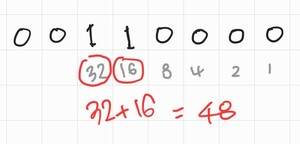

연산자2
=============

<br>


비트 연산자
------
* 이진수 피연산자를 비트 단위로 연산할 때 사용
    * &(and)
    * |(or)
    * ^(xor)
    * ~(not)

### &(and) 연산자
```
    int op1 = 12; // 0000 0000 0000 0000 0000 0000 0000 1100
    int op2 = 9;  // 0000 0000 0000 0000 0000 0000 0000 1001
 
    int andResult = op1 & op2;   // ??
```
||||||
|----|----|----|----|----|
|op1|1|1|0|0|
|op2|1|0|0|1|
|AND|1|0|0|0|
* 둘다 조건에 만족할때 true(1)가 나옴
* 그래서 위 문제의 최종 답은 8 이다.


### |(or)연산자
```
    int op1 = 12; // 0000 0000 0000 0000 0000 0000 0000 1100
    int op2 = 9;  // 0000 0000 0000 0000 0000 0000 0000 1001
 
    int andResult = op1 | op2;   // ??
```
||||||
|----|----|----|----|----|
|op1|1|1|0|0|
|op2|1|0|0|1|
|OR|1|1|0|1|
* 둘 중에 하나라도 값이 있으면 true(1)가 나옴
* 그래서 위 문제의 최종 답은 8+4+1 이여서 13이 나온다.

### ^(xor연산자)
```
    int op1 = 12; // 0000 0000 0000 0000 0000 0000 0000 1100
    int op2 = 9;  // 0000 0000 0000 0000 0000 0000 0000 1001
 
    int andResult = op1 ^ op2;   // ??
```
||||||
|----|----|----|----|----|
|op1|1|1|0|0|
|op2|1|0|0|1|
|XOR|0|1|0|1|
* 두개가 다른 값이여야 true(1)가 나옴
* 그래서 위 문제의 최종 답은 4+1 이여서 5가 나온다.

### ~(not) 연산자
```
    int op1 = 12; // 0000 0000 0000 0000 0000 0000 0000 1100
 
    int andResult = ~op1;   // ??
```
(매우 간략화한 예)
||||||
|----|----|----|----|----|
|op1|**0**(28개)|1|1|0|0|
|NOT|**1**(28개)|0|0|1|1|
* 비트단위로 뒤집어 버린다.
* 그래서 위 문제의 최종 답은 -13 이다.


<br>

비트 이동(bit shift) 연산자
------
* 비트를 왼쪽 혹은 오른쪽으로 움직이는 연산자들
    * <<(left-shift)
    * >>(right-shift)

### <<(left-shift) 연산자
* 왼쪽으로 이동 하는 연산자
```
    int op1 = 12; // 0000 .... 0000 1100

    int leftShifResult1 = op1 << 1;  //??
    int leftShiftReult2 = op1 << 2;  //??
```
(매우 간략화한 예)
|||||||||
|----|----|----|----|----|----|----|----|
|op1|0|0|0|0|1|1|0|0|

문제 leftShifResult1는 **왼쪽으로 한 칸씩 이동**

|||||||||
|----|----|----|----|----|----|----|----|
|____|0|0|0|1|1|0|0|0|
* 그래서 정답은 24


문제 leftShifResult2는 **왼쪽으로 두 칸씩 이동**

|||||||||
|----|----|----|----|----|----|----|----|
|____|0|0|1|1|0|0|0|0|
* 그래서 정답은 48



* 이렇게 계산을 다 하고 나면은 패턴이 보임
* 12 * 2 = 24 이고 24 * 2 = 48 
* 왼쪽으로 이동할때는 2씩 곱함


### >>(right-shift) 연산자
* 오른쪽으로 이동하는 연산자
```
    int op1 = 12; // 0000 .... 0000 1100

    int leftShifResult1 = op1 >> 3;  //??
    int leftShiftReult2 = op1 >> 4;  //?? 
```
(매우 간략화한 예)
|||||||||
|----|----|----|----|----|----|----|----|
|op1|0|0|0|0|1|1|0|0|

문제 leftShifResult1는 **오른쪽으로 세 칸씩 이동**

|||||||||
|----|----|----|----|----|----|----|----|
|____|0|0|0|0|0|0|0|1|
* 그래서 정답은 1

문제 leftShifResult2는 **오른쪽으로 네 칸씩 이동**

|||||||||
|----|----|----|----|----|----|----|----|
|____|0|0|0|0|0|0|0|0|
* 그래서 정답은 0
<br>

* 이렇게 계산을 다 하고 나면은 패턴이 보임
* 오른쪽을 하나씩 밀때도 2씩 나누면 된다. 즉, <br>
12/2 = 6<br>
6/2 = 3<br>
3/2 = 1.5<br>
1.5/2 = 0.75<br> 
이니깐 >> 3 은 1.5가 되고 나머지 소수점을 버리면 1이 나온다. 마찬가지로 >> 4는 0.75가 되서 소수점을 버리면 0 이 나온다. (이렇게 생각하고 풀면 굉장히 쉬울거다.)

<br>

**비트 이동연산자에 우항으로 부동소수점 수는 사용 불가능**

<br>

코드 보기: 비트플래그
------
```
    const int BIT_FLAG_SIZE = 8;

    byte bitFlage = 0;

    byte mask1 = 1 << 2;

    bitFlags |= mask1;
```
* 오른쪽에서부터 세 번째 비트를 참(true)로 설정해보자. 어떻게 해야할까?
    * mask1 값은 2진수 '00000100'
<br>

```
    byte mask3 = (1 << 3) | (1 << 5);

    bitFlags |= mask3;
```
* 현재 bitFlags는 '00000100' 였으니 '00000100' | '00101000'를 하면 그 결과는?
    * 00101100

대입(assignment) 연산자
------
* 연산자의 왼쪽에 있는 피연산자에 연산자의 오른쪽에 있는 피연산자의 값을 대입하는 연산자
* 연산기호는 =
* 수학에서는 '대입'및 '같다'로 사용하지만 프로그래밍에서는 아님!

|왼쪽 피연산자|=|오른쪽 피연산자|
|----|----|----|
|int num1|=|10;|
|int num1|=|10 + 20;|
|int num1|=|num1 + num2;|

### 다른 연산자와의 조합
* 대입 연산자는 일부 다른 연산자와 조합이 가능
* 산술 연산자와 조합
```
    int num1 = 10;

    num1 /= 2; // num1 = num1 / 2; 와 같은 의미
    num1 += 14; // num1 = num1 + 14; 와 같은 의미
    num1 *= 2; // num1 = num1 * 2; 와 같은 의미
    num1 -= 20; // num1 = num1 - 20; 와 같은 의미
```
* 비트 연산자와 조합
```
    int num1 = 10;

    num1 <<= 2; // num1 = num1 << 2; 와 같은 의미
    num1 >>= 3; // num1 = num1 >> 3; 와 같은 의미
```