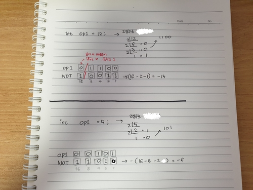
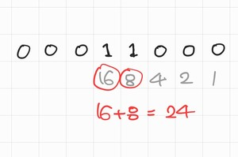

연산자2
=============

<br>


비트 연산자
------
* 이진수 피연산자를 비트 단위로 연산할 때 사용
    * &(and)
    * |(or)
    * ^(xor)
    * ~(not)

### &(and) 연산자
```
    int op1 = 12; // 0000 0000 0000 0000 0000 0000 0000 1100
    int op2 = 9;  // 0000 0000 0000 0000 0000 0000 0000 1001
 
    int andResult = op1 & op2;   // ??
```
||||||
|----|----|----|----|----|
|op1|1|1|0|0|
|op2|1|0|0|1|
|AND|1|0|0|0|
* 둘다 조건에 만족할때 true(1)가 나옴
* 그래서 위 문제의 최종 답은 8 이다.


### |(or)연산자
```
    int op1 = 12; // 0000 0000 0000 0000 0000 0000 0000 1100
    int op2 = 9;  // 0000 0000 0000 0000 0000 0000 0000 1001
 
    int andResult = op1 | op2;   // ??
```
||||||
|----|----|----|----|----|
|op1|1|1|0|0|
|op2|1|0|0|1|
|OR|1|1|0|1|
* 둘 중에 하나라도 값이 있으면 true(1)가 나옴
* 그래서 위 문제의 최종 답은 8+4+1 이여서 13이 나온다.

### ^(xor연산자)
```
    int op1 = 12; // 0000 0000 0000 0000 0000 0000 0000 1100
    int op2 = 9;  // 0000 0000 0000 0000 0000 0000 0000 1001
 
    int andResult = op1 ^ op2;   // ??
```
||||||
|----|----|----|----|----|
|op1|1|1|0|0|
|op2|1|0|0|1|
|XOR|0|1|0|1|
* 두개가 다른 값이여야 true(1)가 나옴
* 그래서 위 문제의 최종 답은 4+1 이여서 5가 나온다.

### ~(not) 연산자
```
    int op1 = 12; // 0000 0000 0000 0000 0000 0000 0000 1100
 
    int andResult = ~op1;   // ??
```
(매우 간략화한 예)
||||||
|----|----|----|----|----|
|op1|**0**(28개)|1|1|0|0|
|NOT|**1**(28개)|0|0|1|1|
* 비트단위로 뒤집어 버린다.
* 그래서 위 문제의 최종 답은 -13 이다.


<br>

비트 이동(bit shift) 연산자
------
* 비트를 왼쪽 혹은 오른쪽으로 움직이는 연산자들
    * <<(left-shift)
    * >>(right-shift)

### <<(left-shift) 연산자
```
    int op1 = 12; // 0000 .... 0000 1100

    int leftShifResult1 = op1 << 1;  //??
    int leftShiftReult2 = op1 << 2;  //??
```
(매우 간략화한 예)
|||||||||
|----|----|----|----|----|----|----|----|
|op1|0|0|0|0|1|1|0|0|

문제 leftShifResult1는 **왼쪽으로 한 칸씩 이동**

|||||||||
|----|----|----|----|----|----|----|----|
|____|0|0|0|1|1|0|0|0|
* 그래서 정답은 24 이다.

