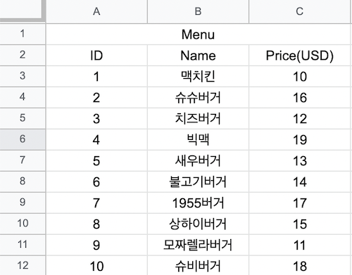
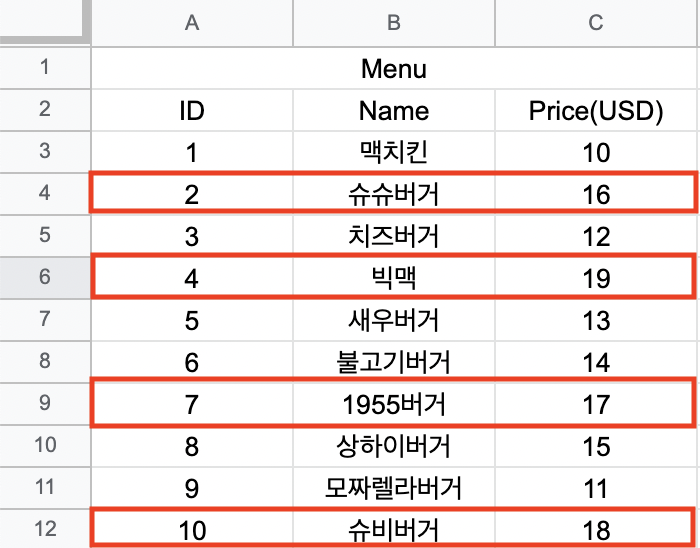

LINQ
========

LINQ 1
----

### 멋 훗날 언젠가 배울 데이터베이스

* 기본적으로 데이터 베이스라는건 표형태로 저장되어 있음

### 앞 테이블의 각 행(row)을 클래스로!
```
    public class MenuItem
    {
        public int ID { get; set; }
        public string Name { get; set; }
        public float Price { get; set; }
        
        public MenuItem(int id, string name, float price)
        {
            ID = id;
            Name = name;
            Price = price;
        }
    }
```
* 👆 위 오브젝트 하나가 표에서는 한줄을 나타냄 

### 그리고 이 데이터를 컬렉션에 담으면?
* 아까 엑셀 테이블과 똑같이 표현 가능
    * 리스트 예)
    ```
        var menuItems = new List<MenuItem>();
        menuItems.Add(new MenuItem(1, "맥치킨", 10.0f));
        menuItems.Add(new MenuItem(1, "모짜렐라버거", 11.0f));
    ```
    * 딕셔너리 예)
    ```
        var menuItems = new Dictionary<int, MenuItem>();
        menuItems.Add(1, new MenuItem(1, "맥치킨", 10.0f));
        menuItems.Add(2, new MenuItem(1, "모짜렐라버거", 11.0f));
    ```

### 쿼리(query)
* 데이터베이스 테이블에서 필요한 데이터만 빠르게 선택(select)하는 법이 있는데 그걸 쿼리라 함
* 엑셀에서 $15 보다 비싼 메뉴를 반환 한다면,



### 쿼리
* 👆 데이터베이스 쿼리로 작성하면 밑에 처럼 됨
    ```
        SELECT * FROM MenuItems
        WHERE price > 15;
    ```
    * SELECT * : 메뉴정보(아이디, 이름, 가격)를 뽑아달라 (여기서 * 은 전부다를 뜻함)
    * FROM MenuItems : MenuItems 테이블에서 메뉴 정보(아이디, 이름, 가격)를 뽑아달라
    * WHERE price > 15 : MenuItems 테이블에서 $15보다 비싼 메뉴 정보(아이디, 이름, 가격)를 뽑아달라

<br>

* C# 에서 위에 처럼 동일한 일을 하려면?

### 방법 1: 반복문
* 컬렉션에서 필요한 개체만 뽑아내는 방법은 당연히 반복문
```
    var filteredItems = new List<MenuItem>(menuItems.Count);
    foreach (var item in menuItems)
    {
        if (item.Price > 15)
        {
            filteredItems.Add(item);
        }
    }
```
* 그런데 데이터베이스에만 익숙한 사람들은 반복문보다 쿼리문이 더 좋다고함
* 그래서 C# 에서도 그걸 지원 그게 바로 **LINQ(Language Integrated Query)**

<br>

LINQ 2
----
### 방법 2: LINQ
```
    // 파일 맨위
    using System.Linq;

    // 메인 함수 어딘가
    var filderedItems = 
        from item in menuItems
        where item.Price > 15
        select item;
```
* 위에 코드를 보면 뭔소리인지 모르겠음 

### 밑에 쿼리문과 LINQ는 정말 똑같이 돈다
```
    // 쿼리문
    SELECT * FROM MenuItems
    WHERE price > 15;
```
```
    // LINQ
    var filderedItems = 
        from item in mneuItems
        where item.Price > 15
        select item;
```
* 코드가 달리 보여도 출력은 똑같이 나옴
* 데이터베이스 관리자는 좋아함
* 하지만 프로그래머에겐 어색함, 우리는 함수에 더 익숙하기 때문
<br>

* 따라서 이 과목에서는 **다른 형태의 LINQ**를 쓸것임
* 둘다 LINQ이므로 똑같은 라이브러리 사용 (using System.Linq;)
* 컬렉션에 System.Linq를 이용하면 예전에 직접 for문을 작성해서 처리했던 많은 것들을 함수 호출 몇번만으로 해결 가능

### LINQ 함수들
* [where()](https://docs.microsoft.com/ko-kr/dotnet/api/system.linq.enumerable.where?view=net-5.0)
* [OrderBy()](https://docs.microsoft.com/ko-kr/dotnet/api/system.linq.enumerable.orderby?view=net-5.0), [OrderByDescending()](https://docs.microsoft.com/ko-kr/dotnet/api/system.linq.enumerable.orderbydescending?view=net-5.0)
* [ThenBy()](https://docs.microsoft.com/ko-kr/dotnet/api/system.linq.enumerable.thenby?view=net-5.0), [ThenByDescending()](https://docs.microsoft.com/ko-kr/dotnet/api/system.linq.enumerable.thenbydescending?view=net-5.0)
* [First()](https://docs.microsoft.com/ko-kr/dotnet/api/system.linq.enumerable.first?view=net-5.0), [FirstOrDefault()](https://docs.microsoft.com/ko-kr/dotnet/api/system.linq.enumerable.firstordefault?view=net-5.0)
* [All()](https://docs.microsoft.com/ko-kr/dotnet/api/system.linq.enumerable.all?view=net-5.0), [Any()](https://docs.microsoft.com/ko-kr/dotnet/api/system.linq.enumerable.any?view=net-5.0)
* [ToList()](https://docs.microsoft.com/ko-kr/dotnet/api/system.linq.enumerable.tolist?view=net-5.0), [ToArray()](https://docs.microsoft.com/ko-kr/dotnet/api/system.collections.generic.list-1.toarray?view=net-5.0), [ToDictionary()](https://docs.microsoft.com/ko-kr/dotnet/api/system.linq.enumerable.todictionary?view=net-5.0)
* [Select()](https://docs.microsoft.com/ko-kr/dotnet/api/system.linq.enumerable.select?view=net-5.0)
* 기타 등등 많음

### Where() 예
```
    var menuItems = new List<MenuItem>(); // 10개의 메뉴 목록이 들어 있음

    var filderedItems = menuItems.Where(m => m.price > 15.0f);

    foreach (MenuItem item in filteredItems)
    {
        Console.WriteLine($"ID({item.ID}), Name({item.Name}), Price(${item.Price})");
    }
```
* 특정 조건에 맞는 데이터만 찾아서 반환
```
    var filderedItems = menuItems.Where(m => m.Price > 15.0f);
```
* 👆 위 코드 읽는 방법
    * **m** : menuItems 안에 있는 각 요소를 의미 
        * foreach (MenuItem m in menuItems) 가 줄어서 **m**이 됐다고 보면 됨
    * **=>** : "~에 대해" 라는 의미라 보면 됨
    * 그러면 위에 **m =>**은 menuItems 안에 있는 각 m에 대해 라고 읽으면 됨
    * **m.Price > 15.0f** : Price > 15.0f 조건이 참이면 반환할 목록에 추가 
        ```
            if (m.Price > 15.0f)
            {
                filderedItems.Add(m);
            }
        ```
        Price > 15.0f 은 위의 축약됐다고 보면 됨
* var filderedItems = menuItems.Where(m => m.Price > 15.0f); 이거를 다시보면 menuItems 안에 있는 메뉴중에 $15보다 비싼 메뉴들을 filteredItems에 추가해서 반환하는 코드 라고 읽으면 됨

<br>

LINQ 3
----
### Where()
* 특정 조건에 맞는 데이터만 찾아서 반환
    * menuItems 안에 있는 메뉴 중에 $15보다 비싼 메뉴들을 filteredItems에 추가해서 반환하는 코드
    ```
        var filteredItems = menuItems.Where(m => m.Price > 15.0f);
    ```
* 그럼 👇이건 무엇을 하는 코드 일까?
    * menuItems안에 있는 메뉴 중에 가격이 $14 이하고, 이름에 "super"를 포함한 메뉴 목록을 filteredItems1에 반환하는 코드
    ```
        var filteredItems1 = menuItems.Where(m => m.Price <= 14.0f && m.Name.Contains("Super"));
    ```
### OrderBy() / ThenBy() 
* 두 함수 모두 오름차순으로 정렬 후 반환함
* 별도의 정렬 기준을 추가하고 싶다면 ThenBy()를 사용
```
    var filteredItems = menuItems.OrderBy(m => m.Price);

    // 메뉴를 가격의 오름차순으로 정렬 후 filteredItems에 반환
```
```
    var filteredItems2 = menuItems.OrderBy( m => m.Price)
                                  .ThenBy( m => m.Name);

    // 메뉴를 가격의오름차순으로 정렬한 뒤, 다시 이름의 오름차순으로 정렬 후 filteredItems2에 반환
```

### OrderByDescending()과 ThenByDescending()
* 두 함수 모두 내림차순으로 정렬 후 반환함
* 별도의 정렬 기준을 추가하고 싶다면 ThenByDescending()을 사용
```
    var filteredItems = menuItems.OrderByDescending(m => m.Price);

    // 메뉴를 가격의 내림차순으로 정렬 후 filteredItems 반환
```
```
    var filteredItems = menuItems.OrderByDescending( m => m.Price)
                                 .ThenByDescending( m => m.Name);

    // 메뉴를 가격의 내림차순으로 정렬한 뒤, 다시 이름의 내림찬수능로 정렬 후 filteredItems에 반환
```

### 섞어 사용해도 괜찮음
```
    var filteredItems = menuItems.OrderByDescending( m => m.Price)
                                 .ThenBy(m => m.Name);
    // 메뉴를 가격의 내림차순으로 정렬한 뒤, 다시 이름의 오름차순으로 정렬 후 filteredItems 에 반환
```
```
    var filteredItems = menuItems.Order(m => m.Price)
                                 .ThenByDescending(m => m.Name);
    // 메뉴를 가격의 오름차순으로 정렬한 뒤, 다시 이름의 내림차순으로 정렬 후 filteredItems에 반환
```

### Where()와 함께 쓸 수 있음
* OrderByXX()는 Where() 혹은 다른 함수들과 합칠(chaining) 수 있음
```
    var filteredItems = menuItems.Where( m => m.Price < 15)
                                 .OrderBy(item => item.Price);
                                 .ThenByDescending(m => m.Name);
```

### First()
* 데이터 셋(data set) 에서 가장 처음 요소를 반환
```
    var item1 = menuItems.OrderBy(m => m.Price).First();
    var item2 = menuItems.OrderByDescending(m => m.Price).First();
```
* 그러나 비어 있으면 예외 발생!
```
    var item = menuItems.Where(m => m.Price < 0)
                        .OrderBy(m => m.Price)
                        .First();
```

### FirstOrDefault()
```
 var item = menuItems.Where(m => m.Price < 0)
                        .OrderBy(m => m.Price)
                        .FirstOrDefault();
```
* 조건에 맞는 첫 요소를 못 찾을 경우 기본값(default)을 반환
* 클래스형의 기본값은? null


<br>

LINQ 4
-----

### All()
* 모든 데이터가 특정 조건을 만족하는지 평가
    * 그럴 경우 true, 아닐경우 false 반환
    ```
        bool result = menuItems.All(m => m.Price >= 0); // true

        // 모두 메뉴의 가격이 $0 이상인가?
    ```
    ```
        bool result = menuItems.All(m => m.Price >= 15); //false
        
        // 모든 메뉴의 가격이 $15 이상인가?
    ```

### Any()
* 데이터 셋에 있는 데이터 중 하나라도 특정 조건을 만족하는지 평가
    * 그럴 경우 true, 아닐 경우 false 반환
    ````
        bool result = menuItems.Any(m => m.Price >= 15); // true

        // 메뉴 중 하나라도 $15 이상인 메뉴가 있는가?
    ````
    ````
        bool result2 = menuItems.Any(m => m.Price < 10); // false

        // 메뉴 중 하나라도 $10미만인 메뉴가 있는가?
    ````

### ToList() / ToArray() / ToDictionary()
* 현재 쿼리 결과를 리스트, 배열, 딕셔너리로 변환해줌
```
    var menuItmes = new List<MenuItems>(); // 10개의 메뉴가 들어있음

    List<MenuItem> item1 = menuItems.Where(m => m.Price < 15).ToList();

    MenuItem[] items2 = menuItems.Where(m => m.Price < 15>).ToArray();

    Dictionary<int, MenuItem> item3 = menuItems.Where(m => m.Price < 15)
                                               .ToDictionary(m => m.ID);
```

#### Select();
* 큰 개체 하나에서 몇개 멤버만 새로운 개체를 만드는 법
```
     var menuItmes = new List<MenuItems>(); // 10개의 메뉴가 들어있음

     var items1 = menuItems.Select(m => new {m.Name, m.Price});

     var item = items1.FirstOrDefault();
     if (item != null)
     {
         Console.WriteLine($"{item.Name}: ${item.Price}");
     }
```

### Select() 보다 더 나은 방법
```
    public class DisplayMenuItem
    {
        public string Name {get; set;}
        public float Price {get; set;}
    }

    //메인 함수
    var menuItems = new List<MenuItem>(); // 10개의 메뉴가 들어있음
    
    var items = menuItems.Select(m => new DispalyMenuItem {Name = m.Name, Price = m.Price});

    DisplayMenuItme dispalyItem = items.FirstOrDefault();
    if (displayItem != null)
    {
        Console.WriteLine($"{displayItme.Name}: ${dispalyItem.Price}");
    }
```
* new DispalyMenuItem {Name = m.Name, Price = m.Price} 이런식으로 쓸수 있음

### LINQ 사용시 주의점1 : 내부를 이해할 것
* LINQ는 매우 유용한 함수들을 제공
* 그러나 내부를 제대로 이해하지 못하고 쓴다면 불필요하게 코드가 느려질수 있음

### LINQ 사용시 주의점2 : 가독성
* 디버깅도 쉽지 않고 읽기도 어렵다 
* 되도록이면 짧게 짜야 가독성이 높아진다
* 긴 LINQ는 쪼개서 써라