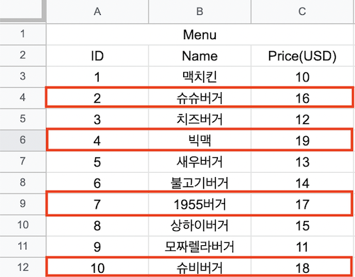

LINQ
========

LINQ 1
----

### 멋 훗날 언젠가 배울 데이터베이스

* 기본적으로 데이터 베이스라는건 표형태로 저장되어 있음

### 앞 테이블의 각 행(row)을 클래스로!
```
    public class MenuItem
    {
        public int ID { get; set; }
        public string Name { get; set; }
        public float Price { get; set; }
        
        public MenuItem(int id, string name, float price)
        {
            ID = id;
            Name = name;
            Price = price;
        }
    }
```
* 👆 위 오브젝트 하나가 표에서는 한줄을 나타냄 

### 그리고 이 데이터를 컬렉션에 담으면?
* 아까 엑셀 테이블과 똑같이 표현 가능
    * 리스트 예)
    ```
        var menuItems = new List<MenuItem>();
        menuItems.Add(new MenuItem(1, "맥치킨", 10.0f));
        menuItems.Add(new MenuItem(1, "모짜렐라버거", 11.0f));
    ```
    * 딕셔너리 예)
    ```
        var menuItems = new Dictionary<int, MenuItem>();
        menuItems.Add(1, new MenuItem(1, "맥치킨", 10.0f));
        menuItems.Add(2, new MenuItem(1, "모짜렐라버거", 11.0f));
    ```

### 쿼리(query)
* 데이터베이스 테이블에서 필요한 데이터만 빠르게 선택(select)하는 법이 있는데 그걸 쿼리라 함
* 엑셀에서 $15 보다 비싼 메뉴를 반환 한다면,



### 쿼리
* 👆 데이터베이스 쿼리로 작성하면 밑에 처럼 됨
    ```
        SELECT * FROM MenuItems
        WHERE price > 15;
    ```
    * SELECT * : 메뉴정보(아이디, 이름, 가격)를 뽑아달라 (여기서 * 은 전부다를 뜻함)
    * FROM MenuItems : MenuItems 테이블에서 메뉴 정보(아이디, 이름, 가격)를 뽑아달라
    * WHERE price > 15 : MenuItems 테이블에서 $15보다 비싼 메뉴 정보(아이디, 이름, 가격)를 뽑아달라

<br>

* C# 에서 위에 처럼 동일한 일을 하려면?

### 방법 1: 반복문
* 컬렉션에서 필요한 개체만 뽑아내는 방법은 당연히 반복문
```
    var filteredItems = new List<MenuItem>(menuItems.Count);
    foreach (var item in menuItems)
    {
        if (item.Price > 15)
        {
            filteredItems.Add(item);
        }
    }
```
* 그런데 데이터베이스에만 익숙한 사람들은 반복문보다 쿼리문이 더 좋다고함
* 그래서 C# 에서도 그걸 지원 그게 바로 **LINQ(Language Integrated Query)**

<br>

LINQ 2
----
### 방법 2: LINQ
```
    // 파일 맨위
    using System.Linq;

    // 메인 함수 어딘가
    var filderedItems = 
        from item in menuItems
        where item.Price > 15
        select item;
```
* 위에 코드를 보면 뭔소리인지 모르겠음 

### 밑에 쿼리문과 LINQ는 정말 똑같이 돈다
```
    // 쿼리문
    SELECT * FROM MenuItems
    WHERE price > 15;
```
```
    // LINQ
    var filderedItems = 
        from item in mneuItems
        where item.Price > 15
        select item;
```
* 코드가 달리 보여도 출력은 똑같이 나옴
* 데이터베이스 관리자는 좋아함
* 하지만 프로그래머에겐 어색함, 우리는 함수에 더 익숙하기 때문
<br>

* 따라서 이 과목에서는 **다른 형태의 LINQ**를 쓸것임
* 둘다 LINQ이므로 똑같은 라이브러리 사용 (using System.Linq;)
* 컬렉션에 System.Linq를 이용하면 예전에 직접 for문을 작성해서 처리했던 많은 것들을 함수 호출 몇번만으로 해결 가능

### LINQ 함수들
* [where()](https://docs.microsoft.com/ko-kr/dotnet/api/system.linq.enumerable.where?view=net-5.0)
* [OrderBy()](https://docs.microsoft.com/ko-kr/dotnet/api/system.linq.enumerable.orderby?view=net-5.0), [OrderByDescending()](https://docs.microsoft.com/ko-kr/dotnet/api/system.linq.enumerable.orderbydescending?view=net-5.0)
* [ThenBy()](https://docs.microsoft.com/ko-kr/dotnet/api/system.linq.enumerable.thenby?view=net-5.0), [ThenByDescending()](https://docs.microsoft.com/ko-kr/dotnet/api/system.linq.enumerable.thenbydescending?view=net-5.0)
* [First()](https://docs.microsoft.com/ko-kr/dotnet/api/system.linq.enumerable.first?view=net-5.0), [FirstOrDefault()](https://docs.microsoft.com/ko-kr/dotnet/api/system.linq.enumerable.firstordefault?view=net-5.0)
* [All()](https://docs.microsoft.com/ko-kr/dotnet/api/system.linq.enumerable.all?view=net-5.0), [Any()](https://docs.microsoft.com/ko-kr/dotnet/api/system.linq.enumerable.any?view=net-5.0)
* [ToList()](https://docs.microsoft.com/ko-kr/dotnet/api/system.linq.enumerable.tolist?view=net-5.0), [ToArray()](https://docs.microsoft.com/ko-kr/dotnet/api/system.collections.generic.list-1.toarray?view=net-5.0), [ToDictionary()](https://docs.microsoft.com/ko-kr/dotnet/api/system.linq.enumerable.todictionary?view=net-5.0)
* [Select()](https://docs.microsoft.com/ko-kr/dotnet/api/system.linq.enumerable.select?view=net-5.0)
* 기타 등등 많음

### Where() 예
```
    var menuItems = new List<MenuItem>(); // 10개의 메뉴 목록이 들어 있음

    var filderedItems = menuItems.Where(m => m.price > 15.0f);

    foreach (MenuItem item in filteredItems)
    {
        Console.WriteLine($"ID({item.ID}), Name({item.Name}), Price(${item.Price})");
    }
```
* 특정 조건에 맞는 데이터만 찾아서 반환
```
    var filderedItems = menuItems.Where(m => m.Price > 15.0f);
```
* 👆 위 코드 읽는 방법
    * **m** : menuItems 안에 있는 각 요소를 의미 
        * foreach (MenuItem m in menuItems) 가 줄어서 **m**이 됐다고 보면 됨
    * **=>** : "~에 대해" 라는 의미라 보면 됨
    * 그러면 위에 **m =>**은 menuItems 안에 있는 각 m에 대해 라고 읽으면 됨
    * **m.Price > 15.0f** : Price > 15.0f 조건이 참이면 반환할 목록에 추가 
        ```
            if (m.Price > 15.0f)
            {
                filderedItems.Add(m);
            }
        ```
        Price > 15.0f 은 위의 축약됐다고 보면 됨
* var filderedItems = menuItems.Where(m => m.Price > 15.0f); 이거를 다시보면 menuItems 안에 있는 메뉴중에 $15보다 비싼 메뉴들을 filteredItems에 추가해서 반환하는 코드 라고 읽으면 됨


