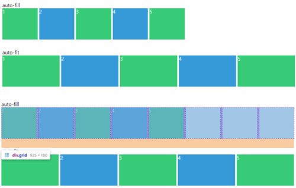
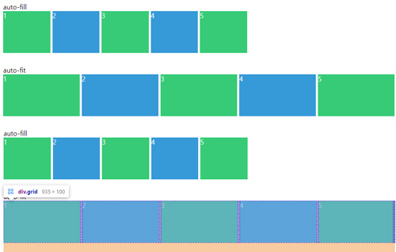

#2 GRID
=============
* 페이지를 여러 주요 영역으로 나누거나, 크기와 위치 및 문서 계층 구조의 관점에서 HTML 기본 요소로 작성된 콘트롤 간의 관계를 정의
* 세로 열과 가로 행을 기준으로 요소를 정렬
    * Flex는 한 방향 레이아웃 시스템이고 (1차원)
    * Grid는 두 방향(가로-세로) 레이아웃 시스템 (2차원)
* 부모 요소를 Grid Container 라고 부르고, 자식요소를 Grid item 이라고 부름

<br>

### 그리드 형태 정의
#### grid-template
* grid-template-rows, grid-template-columns 그리고 grid-template-areas의 단축 속성
```
    예시) 
    .container {
        grid-template: <grid-template-rows> / <grid-template-columns>;
        grid-template: <grid-template-areas>;
    }

    예시)
    .container {
        grid-template:
            [1행시작선이름] "AREAS" 행너비 [1행끝선이름]
            [2행시작선이름] "AREAS" 행너비 [2행끝선이름]
            / <grid-template-columns>;
    }

    예시)

    .container {
        display: grid;
        grid-template:
            "header header header" 80px
            "main main aside" 350px
            "footer footer footer" 130px
            / 2fr 100px 1fr;
    }
    header { grid-area: header; }
    main   { grid-area: main; }
    aside  { grid-area: aside; }
    footer { grid-area: footer; }
```
#### grid-template-rows
* 행(row)의 배치
```
    grid-template-rows: auto;
    grid-template-rows: 40px 4em 40px;
    grid-template-rows: 1fr 2fr 1fr;
    grid-template-rows: 3ch auto minmax(10px, 60px);
```
* fr은 fraction 으로 숫자 비율대로 트랙의크리를 나눔
* 👆 위의 예시 처럼 1fr 2fr 1fr 은 1:2:1 의 row을 만들겠다는 의미

#### grid-template-columns
* 열(column)의 배치
```
    grid-template-columns: 60px 60px;
    grid-template-columns: 1fr 60px;
    grid-template-columns: 1fr 2fr;
    grid-template-columns: 8ch auto;
    grid-template-columns: repeat(5, 1fr);
```

#### grid-template-areas
* 영역(Area) 이름을 참조해 템플릿 생성
* 지정된 그리드 영역 이름(grid-area)을 참조해 그리드 템플릿을 생성
* grid-area는 Grid Container가 아닌 Grid Item에 적용하는 속성
```
    .container {
        display: grid;
        grid-template-rows: repeat(3, 100px);
        grid-template-columns: repeat(3, 1fr);
        grid-template-areas:
            "header header header"
            "main main aside"
            "footer footer footer";
    }
    header { grid-area: header; }
    main   { grid-area: main;   }
    aside  { grid-area: aside;  }
    footer { grid-area: footer; }
```


##### repeat 함수
* repeat는 반복되는 값을 자동으로 처리할 수 있는 함수
* repeat(반복횟수, 반복값)
* 예시로 grid-template-columns: repeat(5, 1fr); 은 1fr 1fr 1fr 1fr 1fr 과 같음

##### minmax 함수
* 최솟값과 최댓값을 지정할 수 있는 함수
* 예시로 minmax(100px, auto)의 의미는 최소한 100px, 최대는 자동으로(auto) 늘어남

##### auto-fill
* column을 만들어주는 일을 함
* 남는 공간(빈 트랙)을 그대로 유지



##### auto-fit
* 남는 공간(빈 트랙) 없이 딱 맞게 늘림



<br>

### 간격 만들기
#### row-gap
* 행과 행 사이의 간격(Line)을 정의

#### column-gap
* 각 열과 열 사이의 간격(Gutter)을 지정

#### gap
* 각 행과 행, 열과 열 사이의 간격(Gutter)을 지정

<br>

### 그리드 형태를 자동으로 정의
#### grid-auto-columns
* 암시적인 열(Track)의 크기를 정의
* grid-template-columns(또는 grid-template-rows)의 통제를 벗어난 위치에 있는 트랙의 크기를 지정하는 속성
```
    grid-auto-columns: auto;
    grid-auto-columns: 1fr;
    grid-auto-columns: min-content;
    grid-auto-columns: minmax(10px, auto);
``` 
#### grid-auto-rows
* 암시적인 행(Track)의 크기를 정의
```
    예시)

    .container {
	    grid-template-rows: repeat(3, minmax(100px, auto));
    }
```
* 👆 위의 예시 처럼 row가 3개였기 때문에 repeat 회수를 3으로 지정해 줬음, 그런데 row개수를 미리 알 수 없는 경우라면 grid-auto-columns를 써서 알아서 처리 되도록 하면 됨.
```
    .container {
        grid-auto-rows: minmax(100px, auto);
    }
```

<br>

### 각 셀의 영역 지정
#### grid-column-start
* 특정 item을 표시하기 시작할 열을 지정
```
    grid-column-start: auto;
    grid-column-start: 2;
    grid-column-start: -1;
    grid-column-start: span 2;
```
* span+number : item(칸) 하나하나를 생각하시면 됨

#### grid-column-end
* 특정 item을 표시하기 끝마칠 열을 지정
```
    grid-column-end: auto;
    grid-column-end: 3;
    grid-column-end: span 3;
```
#### grid-column
* grid-column-xxx의 단축 속성(열 시작/끝 위치)
* 이 방법은 코드의 길이도 줄어들고 좀 더 편리하게 코드를 작성 가능
```
    예시 )
    .item {
        grid-column : 1/3;
        /* grid-column : 시;작번호 / 끝 번호; */
        /*  grid-column-start : 1;
        grid-column-end : 3; */
    }
```
* 👆 위의 예시처럼  grid-column : 1/3; 은 grid-column-start : 1; grid-column-end : 3; 을 뜻함

#### grid-row-start
* 특정 item을 표시하기 시작할 행을 지정
```
    grid-row-start: auto;
    rid-row-start: 3;
    grid-row-start: -1;
    grid-row-start: span 2;
```

#### grid-row-end
* 특정 item을 표시하기 끝마칠 행을 지정
```
    grid-row-end: auto;
    grid-row-end: 3;
    grid-row-end: -1;
    grid-row-end: span 3;
```

#### grid-row
* grid-row-start, grid-row-end의 축약형
```
    grid-row: 1;
    grid-row: 1 / 3;
    grid-row: 2 / -1; // -1은 맨 끝을 의미, 맨끝에서 두번째 자리를 원한다면 -2를 쓰면 됨
    grid-row: 1 / span 2;
```
### [당근게임으로 배우는 grid](https://cssgridgarden.com/#ko)