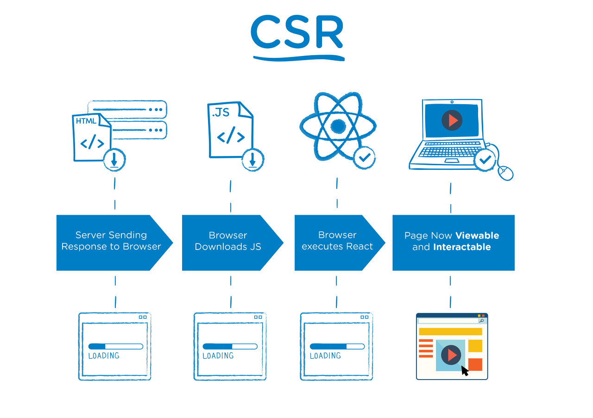

# 서버사이드 렌더링(SSR) & 클라이언트 사이드 렌더링(CSR)

## 렌더링 이란

- 요청해서 받은 내용을 브라우저 화면에 표시하는 것

### 렌더링 과정

- Loader 가 서버로 부터 정보들을 불러옴
- 파싱을 통해 문서를 DOM 트리로 만듬
- DOM 트리가 구축되는 동안 브라우저는 렌터 트리를 구축
- CSS 설정/레이아웃 위치 지정
- 렌터링 트리가 그려짐

## 서버사이드 렌터링(SSR)

- ssr은 페이지 이동할 때마다 새로운 페이지를 요청 한다.
- 모든 탬플릿은 서버 연산을 통해서 렌더링하고 완성된 페이지 형태로 응답한다.
- 장점
  - 검색엔진 최적화(SEO) 가능
    - 서버 사이드 렌더링을 통해 얻을 수 있는 가장 큰 장점 이다.
  - 성능개선
    - 첫 렌더링된 html 을 클라이언트에게 전달해 주기때문에 초기로딩속도를 많이 줄여줄 수 있다. 자바스크립트 파일을 불러오고 렌더링 작업이 완료되기 전에 사용자가 사이트 컨텐츠를 이용할 수 있게된다.
- 단점
  _ 프로젝트의 복잡도
  _ 페이지 이동시 화면이 깜빡 거림 \* 서버 렌더링에 따른 부하가 발생
  **페이지 요청마다 페이지 새로고침이 발생**

## 클라이언트 사이드 렌더링(CSR)

- 장점
  - 첫 요청할때 한페이지만 불러오게 된다.
  - React를 보면 index.js만 불러오게 된다.
  - 그 후, 사용자의 행동에 따른 필요한 부분만 다시 읽어오기 때문에 서버 측에서 렌더링하여 전체 페이지를 다시 읽어들이는 것보다 빠른 인터렉션을 기대할 수 있다. 즉, 필요한 부분만 리로딩 없이 서버로부터 받아서 화면을 갱신하게 된다.
- 단점
  - 초기 구동속도가 느리다.
  - 검색엔지 최적화가 어렵다.
